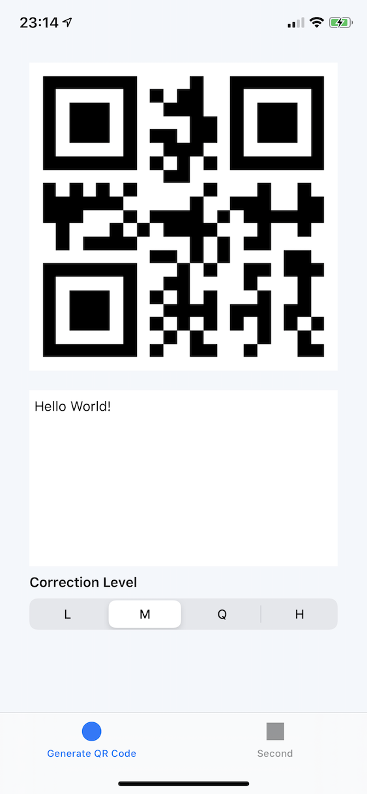
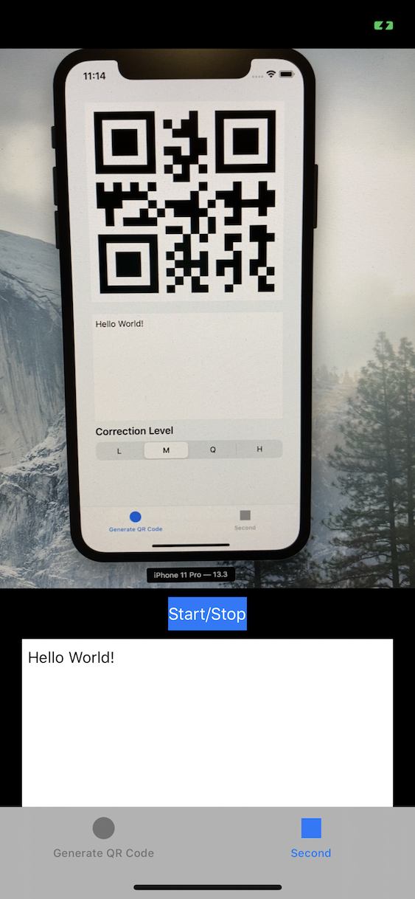

# QRCode Generator and Scanner

Demonstrates how to generate a QR code image and how to scan a QR code with the devices camera.

| GeneratorViewController.swift  |  ReaderViewController.swift  |
:-------------------------:|:-------------------------:
  |  


# Project Structure

Xcode's tab based application template, with the application and scene delegates unchanged from the Xcode template.  
The 2 main files are `GeneratorViewController.swift` and `ReaderViewController.swift`.

# Generating QRCodes using CoreImage

iOS has built in support for generating [several different](https://developer.apple.com/library/archive/documentation/GraphicsImaging/Reference/CoreImageFilterReference/index.html#//apple_ref/doc/uid/TP30000136-SW142) 1D and 2D bar codes.

The main part of the generation code uses a `CIFilter` and returns a `CIImage`, which we can turn into a `UIImage` to display on screen.

The filter is given an `NSData` object as the input, and a string representing the amount of error correction to be used when making the QRCode (`L` 7%, `M` 15%, `Q` 25%, or `H` 30%).

```swift
let qrFilter = CIFilter(name: "CIQRCodeGenerator")
// Text
qrFilter?.setValue(text.data(using: .isoLatin1), forKey: "inputMessage")
// Error correction
qrFilter?.setValue("M", forKey: "inputCorrectionLevel")
return qrFilter?.outputImage
```

One small oddity is that, unlike might be expected, the string is not encoded with UTF8, but instead `ISO Latin 1` string encoding.

## Scaling

The resulting image is a QRCode, but is only as big as it needs to be so when you put it in your image view it will be blurry when resized. So first the demo app scales up the `CIImage` to the size of the image view itself.

```swift
let qrCode:CIImage = createQRCode()
let viewWidth = imageView.bounds.size.width;
let scale = viewWidth/qrCode.extent.size.width;
let scaledImage = qrCode.transformed(by: CGAffineTransform(scaleX: scale, y: scale))
imageView.image = UIImage(ciImage: scaledImage)
```

# Reading QRCodes with AVFoundation Metadata

Reading a QRCode is similarly easy on iOS. When setting up a camera capture session (getting output from the camera) you can also attach various metadata outputs, for things such as faces, certain objects and QRCodes.

After getting a configured `AVCaptureSession` we can add our metadata output.

```swift
let metadataOutput = AVCaptureMetadataOutput()

if (captureSession.canAddOutput(metadataOutput)) {
   captureSession.addOutput(metadataOutput)

   metadataOutput.setMetadataObjectsDelegate(self, queue: DispatchQueue.main)
   metadataOutput.metadataObjectTypes = [.qr]
}
```

Then we just need to implement `AVCaptureMetadataOutputObjectsDelegate` and we have the QRCode's contents

```swift
func metadataOutput(_ output: AVCaptureMetadataOutput, didOutput metadataObjects: [AVMetadataObject], from connection: AVCaptureConnection) {
    if let metadataObject = metadataObjects.first {
        guard let readableObject = metadataObject as? AVMetadataMachineReadableCodeObject else { return }
        guard let stringValue = readableObject.stringValue else { return }

        print("QR Code: \(stringValue)")
    }
}
```

You can also ask the camera preview layer to translate the detected object into it's local coordinate system, allowing you to overlay something on the camera view that matches the QRCode's position.

```swift
let qrCodeObject = previewLayer.transformedMetadataObject(for: readableObject)
showQRCodeBounds(frame: qrCodeObject?.bounds)
```
